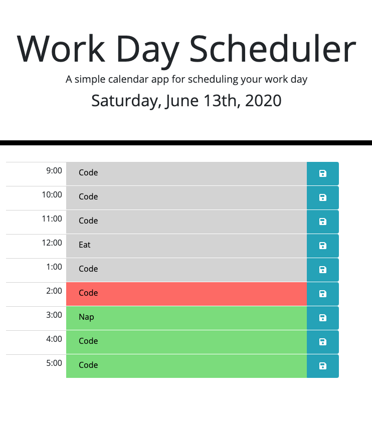

# Day Planner (Homework #5)

## Description 

This day planner was a homework assignment for the Georgia Tech Full Stack Web Development Program. We worked on dynamically generating html via jQuery, we stored information via local storage, and we incorporated momentjs.com to display the current date. We also used momentjs.com to highlight the current hour on the schedule in red, leaving the future time blocks green, and the past time blocks grey.

## Installation

1. Clone the repository from GitHub.
2. Open the index.html file in a default browser.

## Usage 

To access the day planner,
[CLICK HERE](https://elizaregas.github.io/hw5-day-planner/)

## Credits

The functionality for this site was written by Elizabeth Regas. 

Functionality requirements, css, and html were supplied by the Trilogy academic curriculum department.

## MIT License

Copyright (c) [2020] [Eliza Regas]

Permission is hereby granted, free of charge, to any person obtaining a copy
of this software and associated documentation files (the "Software"), to deal
in the Software without restriction, including without limitation the rights
to use, copy, modify, merge, publish, distribute, sublicense, and/or sell
copies of the Software, and to permit persons to whom the Software is
furnished to do so, subject to the following conditions:

The above copyright notice and this permission notice shall be included in all
copies or substantial portions of the Software.

THE SOFTWARE IS PROVIDED "AS IS", WITHOUT WARRANTY OF ANY KIND, EXPRESS OR
IMPLIED, INCLUDING BUT NOT LIMITED TO THE WARRANTIES OF MERCHANTABILITY,
FITNESS FOR A PARTICULAR PURPOSE AND NONINFRINGEMENT. IN NO EVENT SHALL THE
AUTHORS OR COPYRIGHT HOLDERS BE LIABLE FOR ANY CLAIM, DAMAGES OR OTHER
LIABILITY, WHETHER IN AN ACTION OF CONTRACT, TORT OR OTHERWISE, ARISING FROM,
OUT OF OR IN CONNECTION WITH THE SOFTWARE OR THE USE OR OTHER DEALINGS IN THE
SOFTWARE.

---
© 2020 Eliza Regas. All Rights Reserved.

